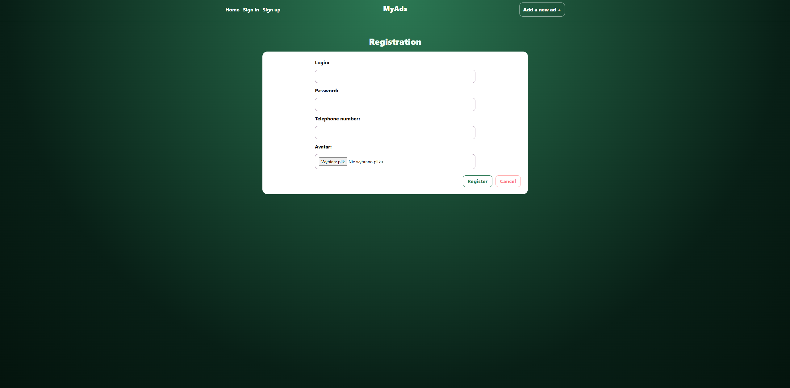
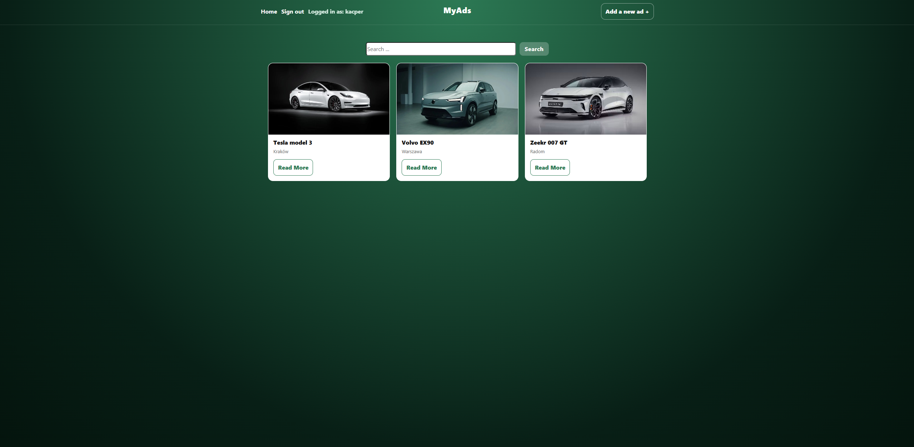
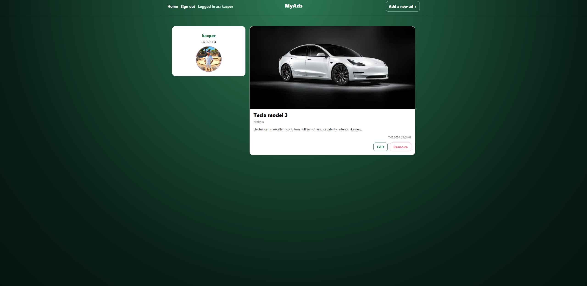
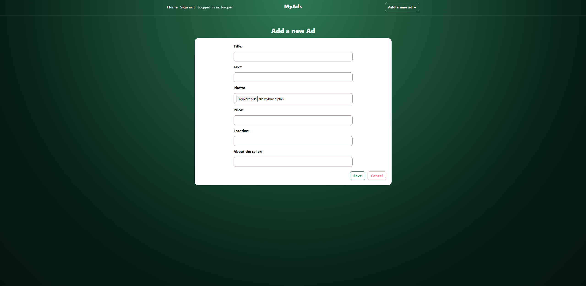

# MyAds – Fullstack Ads Portal

**React · Redux Toolkit · Express · MongoDB**

A full-stack classifieds platform where users can register, log in, and create, edit, and delete ads with image uploads.

The application is built with **React + Redux Toolkit** on the frontend and **Node.js / Express + MongoDB** on the backend.  
Authentication is handled via **session-based authentication using cookies**, with protected routes and authorization logic.

---

## Live Demo

**Frontend:**

https://project-backend-1-itrw.onrender.com/

> The app may take a few seconds to load due to Render cold start.

---

## Features

### Authentication

- User registration with avatar upload
- Login / logout
- Session-based authentication (cookies)
- Persistent sessions stored in MongoDB
- Protected routes (middleware)
- Authorization rules (only the author can edit or delete their ads)

### Ads

- Create new ads (title, description, price, location, image, seller info)
- Browse all ads
- View single ad details with seller information
- Edit ads (author only)
- Delete ads (author only)
- Search ads by title

### Uploads

- Image uploads for ads
- Avatar uploads for users
- File handling via Multer
- Static serving of uploaded files via `/uploads`

---

## Screenshots

| Registration                                  | Home                                    |
| --------------------------------------------- | --------------------------------------- |
|  |  |

| About                           | New ads                             |
| ------------------------------- | ----------------------------------- |
|  |  |

---

## Tech Stack

### Frontend

- React
- Redux Toolkit
- Axios
- React Router
- CSS Modules
- Bootstrap / React-Bootstrap

### Backend

- Node.js
- Express
- MongoDB + Mongoose
- express-session
- connect-mongo (session storage)
- Multer (file uploads)
- bcrypt (password hashing)
- CORS (credentials + origin whitelist)

### Deployment

- Render
  - Static Site (frontend)
  - Web Service (backend)
- MongoDB Atlas

---

## API Overview

### Auth (`/api/auth`)

- `POST /register` – Register user (multipart: avatar)
- `POST /login` – Login (creates session)
- `GET /user` – Get current logged-in user (protected)
- `DELETE /logout` – Logout (destroy session) (protected)

### Ads (`/api/ads`)

- `GET /` – Get all ads
- `GET /:id` – Get ad details (seller populated)
- `GET /search/:searchPhrase` – Search ads by title
- `POST /` – Create new ad (multipart: image) (protected)
- `PUT /:id` – Update ad (multipart: image optional) (protected + author only)
- `DELETE /:id` – Delete ad (protected + author only)

---

## Project Structure

```bash
backend/
  controllers/
  models/
  routes/
  uploads/
  utils/
  server.js
  package.json

client/
  src/
    components/
      common/
      features/
      layout/
      pages/
      redux/
    App.js
  package.json
```

## Installation

### 1. Clone repository

```bash
git clone https://github.com/kacpi95/Project-Backend.git
cd Project-Backend
```

### 2. Backend configuration

**Create backend/.env:**

```bash
MONGO_URL=your_mongodb_atlas_url
SESSION_SECRET=your_secret
CLIENT_URL=http://localhost:3000
PORT=8000
NODE_ENV=development
```

### 3. Run backend

```bash
npm install
npm start
```

**Backend runs at:**

http://localhost:8000

### 4. Frontend configuration

```bash
cd client
npm install
```

### 5. Create client/.env

```bash
REACT_APP_API_BACKEND=http://localhost:8000
REACT_APP_API_URL=http://localhost:8000/api/auth
REACT_APP_API_URL_ADS=http://localhost:8000/api
```

### 6. Run frontend

```bash
npm start
```

**Frontend runs at:**

http://localhost:3000

---

## What I Learned

- Building a fullstack application with React, Express, and MongoDB
- Implementing session-based authentication with cookies in production
- Handling CORS correctly with credentials
- File uploads and static asset serving using Multer
- Structuring backend logic using controllers, routes, and models
- Managing global state with Redux Toolkit
- Debugging real-world deployment issues (CORS, env variables, builds, Render)

---

## Future Improvements

- Pagination for ads list
- User profile page
- Better error handling and notifications
- Image optimization and validation
- Tests (backend + frontend)
